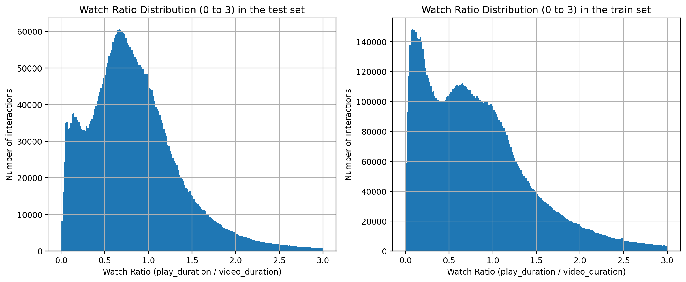
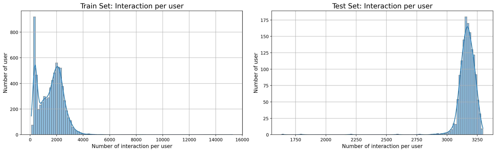
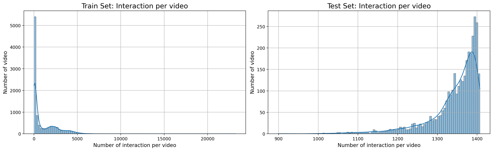
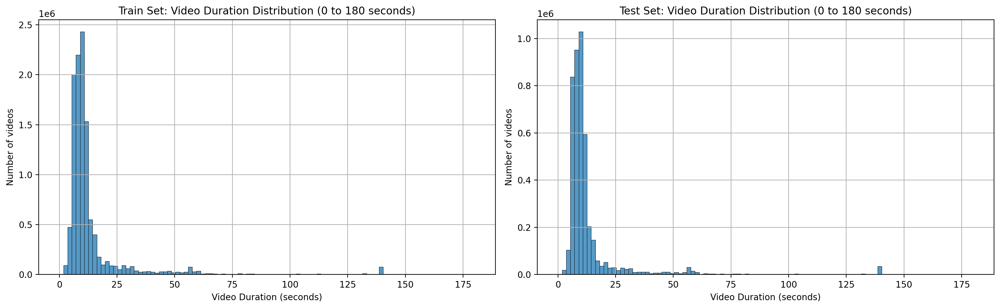
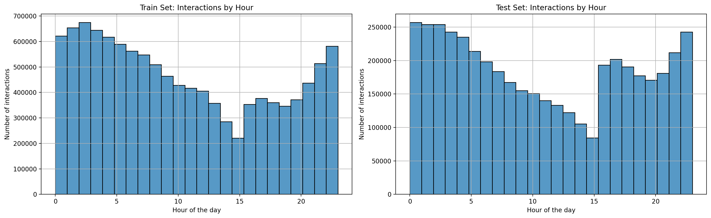
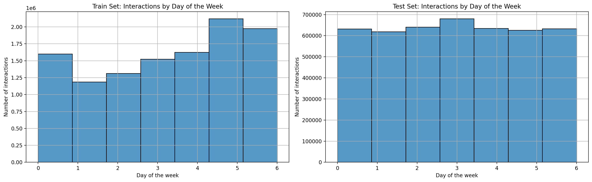
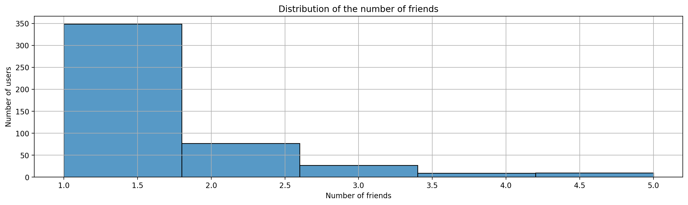
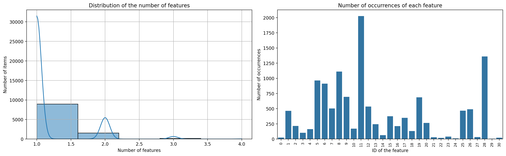

# Kuaishou-System-Recommender - Final Project 2025 - Rick Gao
## Objectifs

L’objectif de ce projet est de développer un système de recommandation de vidéos, basé sur les préférences des utilisateurs, leurs interactions passées, ainsi que sur le contenu. Pour ce projet, le dataset [**KuaiRec**](https://kuairec.com/) a été utilisé et contient un ensemble d'informations sur les utilisateurs, sur les vidéos ainsi que sur les interactions entre les utilisateurs et les vidéos.

## Dataset

### Présentation du dataset

Le dataset de **KuaiRec** est structuré en 7 fichiers contenus dans le dossier `data/`.

```
data/
├── big_matrix.csv
├── item_categories.csv
├── item_daily_features.csv
├── kuairec_caption_category.csv
├── small_matrix.csv
├── social_network.csv
└── user_features.csv
```


- **`big_matrix.csv`** – Interactions utilisateurs-vidéos (sparse)
    - Ce fichier contient les interactions entre 7 176 utilisateurs et 10 728 vidéos, représentant un total de 12 530 805 interactions.
    - Colonnes utiles : **watch_ratio, play_duration, video_duration, timestamp**
    - Ce fichier est utilisé principalement pour l'**entraînement** des modèles.

- **`small_matrix.csv`** – Interactions utilisateurs-vidéos (dense)
    - Ce fichier contient les interactions de 1 411 utilisateurs avec 3 327 vidéos, pour un total de 4 494 578 interactions.
    - Chaque utilisateur a visionné presque toutes les vidéos, à l’exception de quelques cas spécifiques liés à des blocages (user blocked).
    - Ce fichier est utilisé principalement pour l'**évaluation** de nos modèles.

- **`user_features.csv`** – Caractéristiques des utilisateurs
    - Ce fichier fournit des informations pour chaque utilisateur.
    - Colonnes utiles :
        - **user_active_degree, register_days, fans_user_num, friend_user_num**
        - **onehot_feat0 à onehot_feat17**
    - Ces données peuvent enrichir les profils utilisateurs dans les approches de filtrage collaboratif.

- **`item_daily_features.csv`** – Statistiques journalières des vidéos
    - Ce fichier fournit des métriques quotidiennes pour chaque vidéo.
    - Colonnes utiles : **play_cnt, like_cnt, comment_cnt, share_cnt, follow_cnt**
    - Ces données permettent de modéliser la performance d’une vidéo dans le temps

- **`item_categories.csv`** – Catégorisation des vidéos
    - Fichier indiquant les catégories assignées aux vidéos sous forme de listes de tags.

- **`kuairec_caption_category.csv`** – Metadata des vidéos
    - Ce fichier rassemble les titres, descriptions, tags et catégories des vidéos.
    - Colonnes utiles : **caption, topic_tag, first_level_category_name - third_level_category_name**
    - Ces données sont utiles pour du Content-based Filtering

- **`social_network.csv`** – Relations entre les utilisateurs
    - Ce fichier représente la relation entre les utilisateurs (amitié)
    - Ces donnees sont utiles pour du GNN (Graph Neural-Network)

### Analyse du dataset

#### Watch ratio (play_duration / video_duration)


La majorité des utilisateurs ne regardent pas les vidéos en entier. Il faut éviter d’utiliser un seuil trop haut pour considérer une interaction comme positive.

#### Nombre d’interactions par utilisateur


Forte hétérogénéité des comportements. Certains utilisateurs sont extrêmement actifs.


#### Nombre d’interactions par vidéo


La popularité des vidéos est très inégale. Il est nécessaire de proposer plus de diversité sur les vidéos et de faire attention au coverage.

#### Distribution des durées des vidéos


La majorité des vidéos durent entre 5 et 20 secondes, avec un pic autour de 10–12 sec. C'est cohérent, puisque qu'il y a beaucoup de vidéos courtes sur la plateforme KuaiShou. La durée des vidéos proposées peut avoir un intérêt ici.

#### Interactions par heure de la journée


Les utilisateurs regardent majoritairement les vidéos tard le soir ou très tôt le matin. Ainsi, intégrer l'heure dans les features peut avoir un intérêt ici.

#### Interactions par jour de la semaine


On remarque une forte influence le week-end, ce qui est coherent. Les utilisateurs interagissent davantage avec les vidéos à ce moment-là. Un modèle temporel pourrait être bénéfique ici.

#### Distribution du nombre d’amis par utilisateur


Il y a peu de relation entre les utilisateurs (amitié). Cela n'apporte pas beaucoup de valeurs pour les GNN.

#### Distribution du nombre d’occurrences de chaque feature


Certains tags sont très fréquents (ex : les ID 11 et 28). Donc, le contenu tagué est asymétriquement réparti avec quelques catégories qui dominent.

## Présentation du/des modèle(s) implémenté(s)

Plusieurs modèles peuvent être utilisées pour créer un système de recommandation de videos :
- **Collaborative Filtering :** KNN, ALS, SVD, NCF, ...
- **Content-Based Filtering :**  TF-IDF, Cosine Similarity, SVM, RNN, ...
- **Hybrid Recommender Systems :** LightFM, ...

Dans le cadre de ce projet, seulement un modèle de **Collaborative Filtering** sera utilisé :
- **SVD (Singular Value Decomposition)** : Matrix factorization

**SVD** est un bon choix car c'est un bon compromis entre simplicité et performance. 

### Benchmark des scores

Afin de mesurer la performance des modèles de recommandation, plusieurs métriques d'evaluation seront utilisées :
- **Precision@K** : Indique la proportion d’éléments pertinents parmi les K premiers recommandés
- **Recall@K** : Mesure la proportion d’éléments pertinents retrouvés dans les K premiers résultats, par rapport à tous les éléments pertinents existants
- **NDCG@K (Normalized Discounted Cumulative Gain)** : Pénalise les éléments pertinents qui apparaissent loin dans le classement
- **MAP@K (Mean Average Precision)** : Mesure la précision moyenne cumulée sur les positions où des éléments pertinents apparaissent dans le top-K

Ces métriques permettent d’évaluer la pertinence des recommandations produites en tenant compte de l’ordre dans lequel elles sont présentées.

En plus des métriques ci-dessus, nous évaluerons également les aspects suivants :
- **Diversity :** La capacité du système à recommander des items variés et différents les uns des autres.
- **Novelty :** La capacité du système à recommander des items nouveaux et non familiers aux utilisateurs.
- **Coverage :** La capacité du système à recommander une large gamme d'items et à couvrir les différents goûts et préférences des utilisateurs.

#### Tableau du benchmark

| Modèle | K    | Precision@K | Recall@K | MAP@K  | NDCG@K | Diversity | Novelty | Coverage |
| ------ | ---- | ----------- | -------- | ------ | ------ | --------- | ------- | -------- |
| SVD    | 10   | 0.9001      | 0.0138   | 0.8513 | 0.9021 | 0.9758    | 12.2664 | 0.0097   |
| Random | 10   | 0.2552      | 0.0032   | 0.1290 | 0.2574 | 0.9173    | 12.1765 | 0.3062   |
| SVD    | 50   | 0.6577      | 0.1609   | 0.5472 | 0.7043 | 0.8690    | 12.0762 | 0.0405   |
| Random | 50   | 0.1116      | 0.0153   | 0.0272 | 0.1122 | 0.9168    | 12.1597 | 0.3101   |
| SVD    | 1000 | 0.2493      | 0.7512   | 0.3992 | 0.7023 | 0.8665    | 12.1872 | 0.2252   |
| Random | 1000 | 0.1138      | 0.3150   | 0.0383 | 0.2422 | 0.9161    | 12.1633 | 0.3101   |

On observe que le modèle SVD offre un excellent compromis entre précision, pertinence du classement et qualité globale (MAP/NDCG), en particulier pour des valeurs de K faibles. Il surpasse largement la baseline aléatoire, ce qui confirme la validité de l'approche par factorisation matricielle.

Cependant, plus K augmente, plus le rappel progresse mais la précision baisse, ce qui est attendu. Le modèle récupère plus de contenu pertinent, mais avec un peu plus de bruit.

En revanche, la capacité du modèle à explorer l’ensemble du catalogue reste limitée, en particulier lorsque le nombre de recommandations (K) est faible. Cela signifie que le modèle a tendance à recommander toujours les mêmes vidéos populaires, ce qui freine la découverte de contenu moins exposé.

**Les limites du modèle SVD :**
-  Le modèle SVD ne peut pas recommander de vidéos jamais vues ni traiter les nouveaux utilisateurs sans données d'interaction
-  Le modèle ne prend aucune feature temporelle ou de contenu en compte
-  SVD a tendance à favoriser les vidéos les plus populaires

Une piste d’amélioration consisterait à utiliser un NCF (Neural Collaborative Filtering), qui permet de modéliser des interactions non linéaires entre utilisateurs et items, tout en intégrant des features additionnelles pour enrichir la représentation des profils et des contenus.

## Conclusion

Nous avons conçu un système de recommandation basé sur le filtrage collaboratif en exploitant le dataset KuaiRec, riche en interactions, métadonnées et signaux temporels. Le modèle SVD s’est révélé performant en termes de précision, classement et pertinence, surpassant largement les baselines aléatoires.

Malgré cela, le modèle reste limité en couverture, favorisant les vidéos les plus populaires. Il maintient toutefois une bonne diversité et nouveauté, qualités importantes pour la recommandation de contenus courts.